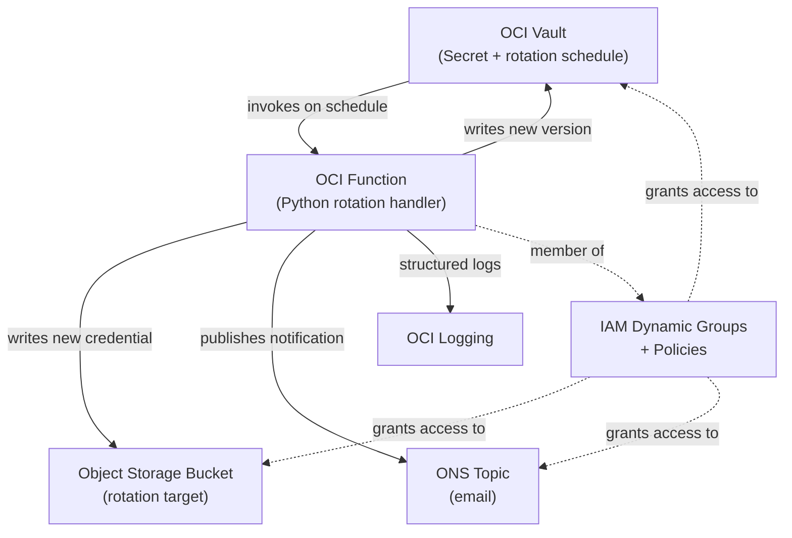

# OCI Secret Lifecycle Service

A production-oriented reference implementation of an OCI-native secret rotation architecture built on **native OCI Vault rotation scheduling**, **custom OCI Function rotation logic**, and **Resource Principal authentication**.

This project demonstrates how credential rotation can be automated on OCI without external schedulers, static runtime credentials, or one-off scripts. OCI Vault drives the rotation schedule, OCI Functions handle target-specific rotation logic, and Resource Principal authentication allows deployed resources to operate without long-lived API keys.

The reference target is Object Storage, but the design is intentionally extensible. Target-specific logic is isolated primarily in `target_client.py`, making it the main change point for adapting the pattern to databases, API tokens, service credentials, or other systems that require controlled secret lifecycle management.

---

## Architecture



> **Note:** This diagram is a simplified view. See [docs/design.md](docs/design.md) for the detailed architecture including compartment boundaries and IAM principals.

A full credential rotation follows a four-step protocol orchestrated by Vault — `VERIFY_CONNECTION` → `CREATE_PENDING_VERSION` → `UPDATE_TARGET_SYSTEM` → `PROMOTE_PENDING_VERSION` — with the Function invoked once per step.

---

## Quickstart

### Prerequisites

- OCI CLI installed and configured (`oci setup config`)
- Terraform ≥ 1.14
- Python 3.12 + pip
- Docker (for building and pushing the Function image)
- jq — for JSON parsing in helper scripts

### 1. Configure OCI authentication

```bash
oci setup config
oci iam region list   # verify it works
```

### 2. Bootstrap remote state bucket

```bash
oci os bucket create --name <bucket-name> --compartment-id <compartment-ocid>
```

### 3. Configure Terraform

Copy both example files (run from the repo root):

```bash
cp infra/backend.hcl.example infra/backend.hcl
cp infra/terraform.tfvars.example infra/terraform.tfvars
```

**Edit `backend.hcl`** — remote state location (bucket created in step 2):

- `bucket` — name of the state bucket
- `namespace` — output of `oci os ns get`
- `region` — your OCI region

**Edit `terraform.tfvars`** — fill these in before continuing:

- `tenancy_ocid`, `user_ocid`, `region`, `compartment_ocid`, `notification_endpoint`
- `secret_name`, `rotation_interval_days`, `ocir_repo`, and `image_tag` have defaults — leave or adjust

### 4. Build and push the Function image

```bash
bash scripts/push-image.sh
```

This reads `region`, `ocir_repo`, and `image_tag` from `terraform.tfvars`, authenticates Docker to OCIR using a short-lived bearer token obtained via the OCI CLI, and pushes the image. The Function resource references the pushed image, so the image must exist in OCIR before the Function can be deployed successfully.

### 5. Deploy infrastructure

```bash
cd infra
terraform init -backend-config=backend.hcl
terraform apply
```

A single apply creates all resources — the Function, Vault secret, and `rotation_config` scheduler are wired together in one pass.

### 6. Trigger a rotation

```bash
cd ..  # back to repo root
source scripts/set-env.sh  # once per shell session after terraform apply
```

Trigger rotation and monitor until complete (Ctrl-C to exit once `SUCCEEDED` appears):

```bash
WORK_REQUEST_ID=$(oci vault secret rotate \
  --secret-id "$SECRET_ID" \
  --query '"opc-work-request-id"' \
  --raw-output)

watch -n 10 "oci work-requests work-request get \
  --work-request-id \"$WORK_REQUEST_ID\" \
  --query 'data.{\"status\":\"status\",\"percent-complete\":\"percent-complete\"}'"
```

`status: SUCCEEDED` and `percent-complete: 100.0` confirm all four rotation steps completed. `status: FAILED` means at least one step failed. See [runbook §1](docs/runbook.md#1-trigger-secret-rotation-manually) for how to verify the rotation result and investigate failures.

---

## Repository Structure

```
oci-secret-rotation/
├── docs/
│   ├── design.md           # Full design doc with architecture and sequence diagrams
│   ├── threat-model.md     # STRIDE-style threat analysis
│   ├── runbook.md          # Operational procedures
│   └── adr/                # Architecture Decision Records
├── infra/                  # Terraform — all OCI infrastructure
│   └── modules/
│       ├── vault/          # KMS key, Vault, Secret
│       ├── function/       # Function app and function resource
│       ├── iam/            # Dynamic groups and policies
│       ├── logging/        # Log groups and ONS topic
│       ├── network/        # Private VCN, service gateway, subnet
│       └── target/         # Object Storage rotation target
├── function/               # Python rotation Function
│   └── tests/
└── scripts/                # Shell helpers
```

---

## Documentation

| Document | Purpose |
|----------|---------|
| [Design doc](docs/design.md) | Architecture, design decisions, security model, future work |
| [Threat model](docs/threat-model.md) | STRIDE analysis of rotation-specific failure modes |
| [Runbook](docs/runbook.md) | Manual rotation, rollback, failure investigation, teardown |
| [ADR 0001](docs/adr/0001-native-rotation-scheduler.md) | Why native Vault scheduling over custom cron |
| [ADR 0002](docs/adr/0002-resource-principal-auth.md) | Why Resource Principals over API keys |
| [ADR 0003](docs/adr/0003-rotation-state-machine.md) | Secret version lifecycle and failure recovery |

---

## Security

- No API keys or long-lived credentials stored on deployed OCI resources
- IAM policies are compartment-scoped, not tenancy-scoped
- Dynamic group matches the specific Function OCID (narrow scope)
- Vault soft-delete retention protects against accidental deletion
- See [docs/threat-model.md](docs/threat-model.md) for the full analysis

---

*This is a reference implementation, not a turnkey production deployment. See [§10 — Future Work](docs/design.md#10-future-work) for known limitations.*
