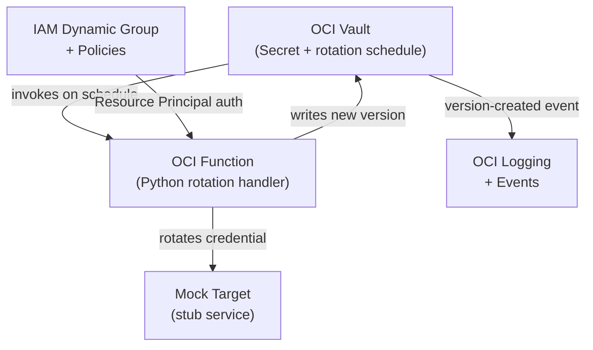

# OCI Secret Lifecycle Service

A production-grade reference implementation of the canonical OCI secret rotation pattern:
**OCI Vault native rotation scheduling** + **custom Function as the rotation target**,
authenticated via Resource Principal (no long-lived credentials anywhere).

---

## Architecture



> **Note:** This diagram is a simplified view. See [docs/design.md](docs/design.md) for the detailed architecture including compartment boundaries and IAM principals.

---

## Quickstart

> Full walkthrough is in [docs/design.md](docs/design.md). Abbreviated steps below.

### Prerequisites

- OCI CLI installed and configured (`oci setup config`)
- Terraform ≥ 1.5
- Python 3.12 + pip
- Docker (for building and pushing the Function image)

### 1. Configure OCI authentication

```bash
oci setup config
oci iam region list   # verify it works
```

### 2. Bootstrap remote state bucket

```bash
oci os ns get
oci os bucket create --name <bucket-name> --compartment-id <compartment-ocid>
```

### 3. Initialize Terraform

```bash
cd infra
cp terraform.tfvars.example terraform.tfvars
# edit terraform.tfvars with your tenancy values
cp backend.hcl.example backend.hcl
# edit backend.hcl with your state bucket name, namespace, and Customer Secret Keys
terraform init -backend-config=backend.hcl
terraform plan
```

### 4. Deploy infrastructure

```bash
terraform apply
```

### 5. Build and deploy the rotation Function

```bash
# docker login to OCIR first — see docs/runbook.md
cd function
docker build -t <region>.ocir.io/<namespace>/secret-rotation:latest .
docker push <region>.ocir.io/<namespace>/secret-rotation:latest
cd ../infra && terraform apply
```

### 6. Trigger a rotation

```bash
oci vault secret rotate --secret-id <secret-ocid>
```

---

## Repository Structure

```
oci-secret-rotation/
├── docs/
│   ├── design.md           # Full design doc with architecture and sequence diagrams
│   ├── threat-model.md     # STRIDE-style threat analysis
│   ├── runbook.md          # Operational procedures
│   └── adr/                # Architecture Decision Records
├── infra/                  # Terraform — all OCI infrastructure
│   └── modules/
│       ├── vault/          # KMS key, Vault, Secret
│       ├── function/       # Function app and function resource
│       ├── iam/            # Dynamic groups and policies
│       └── logging/        # Log groups and events subscription
├── function/               # Python rotation Function
│   └── tests/
└── scripts/                # Bootstrap and teardown helpers
```

---

## Documentation

| Document | Purpose |
|----------|---------|
| [Design doc](docs/design.md) | Architecture, design decisions, security model, future work |
| [Threat model](docs/threat-model.md) | STRIDE analysis of rotation-specific failure modes |
| [Runbook](docs/runbook.md) | Manual rotation, rollback, failure investigation, teardown |
| [ADR 0001](docs/adr/0001-native-rotation-scheduler.md) | Why native Vault scheduling over custom cron |
| [ADR 0002](docs/adr/0002-resource-principal-auth.md) | Why Resource Principals over API keys |
| [ADR 0003](docs/adr/0003-rotation-state-machine.md) | Secret version lifecycle and failure recovery |

---

## Security

- No API keys or long-lived credentials on any OCI resource
- IAM policies are compartment-scoped, not tenancy-scoped
- Dynamic group matches the specific Function OCID (narrow scope)
- Vault soft-delete retention protects against accidental deletion
- See [docs/threat-model.md](docs/threat-model.md) for the full analysis

---

*This is a reference implementation, not a production deployment. See [docs/design.md](docs/design.md) §10 for known limitations and future work.*
