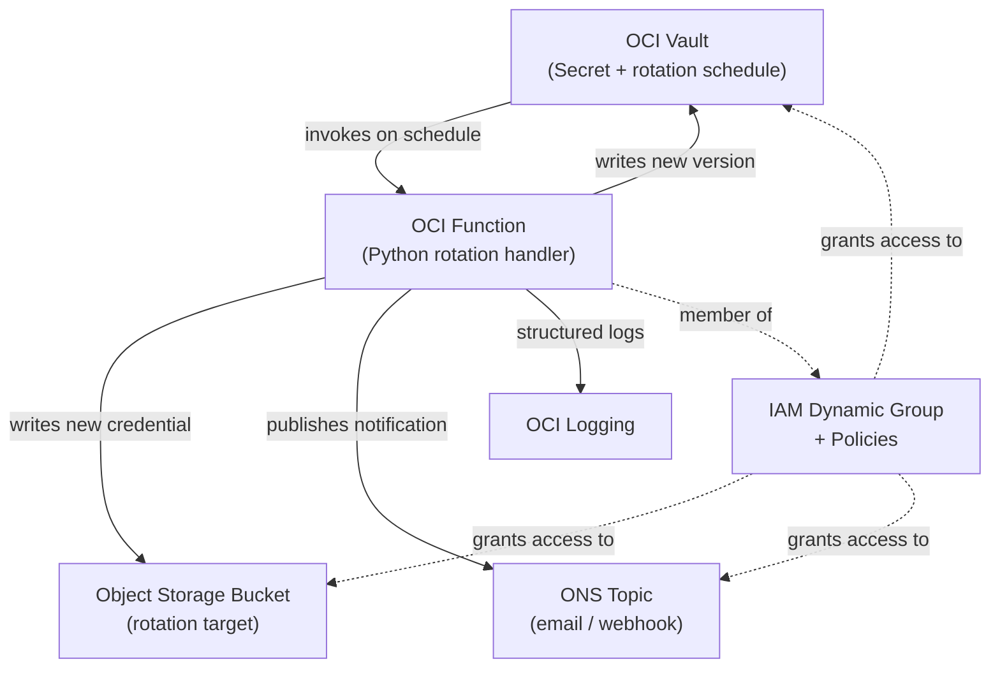

# OCI Secret Lifecycle Service

A production-grade reference implementation of the canonical OCI secret rotation pattern:
**OCI Vault native rotation scheduling** + **custom Function as the rotation target**,
authenticated via Resource Principal (no long-lived credentials anywhere).

---

## Architecture



> **Note:** This diagram is a simplified view. See [docs/design.md](docs/design.md) for the detailed architecture including compartment boundaries and IAM principals.

---

## Quickstart

### Prerequisites

- OCI CLI installed and configured (`oci setup config`)
- Terraform ≥ 1.14
- Python 3.12 + pip
- Docker (for building and pushing the Function image)
- jq (JSON processor) — for OCIR authentication and log output parsing

### 1. Configure OCI authentication

```bash
oci setup config
oci iam region list   # verify it works
```

### 2. Bootstrap remote state bucket

```bash
oci os bucket create --name <bucket-name> --compartment-id <compartment-ocid>
```

### 3. Configure Terraform

Copy both example files (run from the repo root):

```bash
cp infra/backend.hcl.example infra/backend.hcl
cp infra/terraform.tfvars.example infra/terraform.tfvars
```

**Edit `backend.hcl`** — remote state location (bucket created in step 2):

- `bucket` — name of the state bucket
- `namespace` — output of `oci os ns get`
- `region` — your OCI region

**Edit `terraform.tfvars`** — fill these in before continuing:

- `tenancy_ocid`, `user_ocid`, `region`, `compartment_ocid`, `notification_endpoint`
- `secret_name`, `rotation_interval_days`, `ocir_repo`, and `image_tag` have defaults — leave or adjust
- Leave `function_ocid` as `""` for now

### 4. Build and push the Function image

```bash
bash scripts/push-image.sh
```

This reads `region`, `ocir_repo`, and `image_tag` from `terraform.tfvars`, authenticates to OCIR using your OCI CLI credentials, and pushes the image. OCI validates the image exists when creating the function resource, so this must run before `terraform apply`.

### 5. Deploy infrastructure

```bash
cd infra
terraform init -backend-config=backend.hcl
terraform apply
```

After apply completes, extract the Function OCID and update `terraform.tfvars`:

```bash
terraform output -raw function_id  # prints the function_ocid
```

Paste the printed OCID as the value of `function_ocid` in `terraform.tfvars`, then:

```bash
terraform apply                    # wires rotation_config to the vault secret
```

### 6. Trigger a rotation

```bash
cd ..  # back to repo root
source scripts/set-env.sh  # once per shell session after terraform apply
oci fn function invoke \
  --function-id $FUNCTION_ID \
  --body "" \
  --file "-"
```

A successful rotation returns `{"status": "ok", ...}`. Structured logs appear in OCI Logging and a notification email is sent to the address configured in `terraform.tfvars`.

---

## Repository Structure

```
oci-secret-rotation/
├── docs/
│   ├── design.md           # Full design doc with architecture and sequence diagrams
│   ├── threat-model.md     # STRIDE-style threat analysis
│   ├── runbook.md          # Operational procedures
│   └── adr/                # Architecture Decision Records
├── infra/                  # Terraform — all OCI infrastructure
│   └── modules/
│       ├── vault/          # KMS key, Vault, Secret
│       ├── function/       # Function app and function resource
│       ├── iam/            # Dynamic groups and policies
│       ├── logging/        # Log groups and ONS topic
│       ├── network/        # Private VCN, service gateway, subnet
│       └── target/         # Object Storage rotation target
├── function/               # Python rotation Function
│   └── tests/
└── scripts/                # Shell helpers
```

---

## Documentation

| Document | Purpose |
|----------|---------|
| [Design doc](docs/design.md) | Architecture, design decisions, security model, future work |
| [Threat model](docs/threat-model.md) | STRIDE analysis of rotation-specific failure modes |
| [Runbook](docs/runbook.md) | Manual rotation, rollback, failure investigation, teardown |
| [ADR 0001](docs/adr/0001-native-rotation-scheduler.md) | Why native Vault scheduling over custom cron |
| [ADR 0002](docs/adr/0002-resource-principal-auth.md) | Why Resource Principals over API keys |
| [ADR 0003](docs/adr/0003-rotation-state-machine.md) | Secret version lifecycle and failure recovery |

---

## Security

- No API keys or long-lived credentials on any OCI resource
- IAM policies are compartment-scoped, not tenancy-scoped
- Dynamic group matches the specific Function OCID (narrow scope)
- Vault soft-delete retention protects against accidental deletion
- See [docs/threat-model.md](docs/threat-model.md) for the full analysis

---

*This is a reference implementation, not a production deployment. See [docs/design.md](docs/design.md) §10 for known limitations and future work.*
