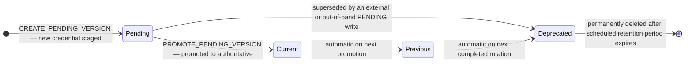

# ADR 0003: Rotation State Machine — Secret Version Lifecycle

**Status:** Accepted
**Date:** 2026-05-16

## Context

Secret rotation is a distributed write that modifies state in two separate systems: OCI Vault (the authoritative secret store) and the rotation target (the system that consumes the credential). Because these two systems cannot be updated atomically, partial failure is possible at every step, and the ordering of operations determines which failures are self-recovering and which require operator intervention.

OCI Vault's native rotation protocol prescribes a fixed four-step sequence, each delivered as a separate Function invocation:

1. `VERIFY_CONNECTION` — confirm readiness before any state changes
2. `CREATE_PENDING_VERSION` — create or reuse a `PENDING` credential version in Vault
3. `UPDATE_TARGET_SYSTEM` — apply the staged credential to the target
4. `PROMOTE_PENDING_VERSION` — make the staged credential authoritative in Vault

OCI orchestrates the sequence and retries individual steps on failure. The decisions below describe how each step is implemented and why.

Four failure modes must be handled:

1. **Step 1 fails** before any write — neither side changed; state is fully consistent
2. **Step 2 fails** after staging a `PENDING` version — the target and Vault `CURRENT` are still consistent; retry reuses the existing `PENDING` version
3. **Step 3 fails** after a `PENDING` version exists in Vault — target still holds the old credential and is consistent with Vault `CURRENT`
4. **Step 4 fails** after the target was updated — target holds the new credential but Vault `CURRENT` still reflects the old one; the two sides are inconsistent until the step succeeds

## Decision

The four-step ordering is prescribed by OCI's native rotation protocol: write to Vault as `PENDING` → update target → promote to `CURRENT`. This ordering is chosen because:

- Failure at step 1 leaves both sides with the old credential — no inconsistency, safe to retry immediately
- Failure at step 2 may leave a `PENDING` version staged in Vault, but `CURRENT` and the target are still consistent — retry reuses the existing `PENDING` version
- Failure at step 3 leaves Vault with a `PENDING` version but `CURRENT` unchanged — target is still consistent with `CURRENT`, and retrying the step reuses the existing `PENDING` version and retries the target write with the same credential
- Failure at step 4 is the only inconsistent case, but it is recoverable: retrying the step finds the `PENDING` version still staged and promotes it; both sides converge on the same credential

**Step idempotency is implemented per step, not per rotation cycle.** Each step is designed to be safe to retry independently:

| Step | Idempotency mechanism |
|------|-----------------------|
| `VERIFY_CONNECTION` | Read-only; no state change |
| `CREATE_PENDING_VERSION` | Checks for an existing `PENDING` version before generating a new credential. If one exists, it is reused — no new credential is generated. Only when no `PENDING` version exists is a new credential created and staged. |
| `UPDATE_TARGET_SYSTEM` | Reads the `PENDING` credential from Vault at call time and writes it to the target unconditionally (`put_object` is last-write-wins). Safe to call multiple times with the same `PENDING` version. |
| `PROMOTE_PENDING_VERSION` | Three-way convergence check: if the requested version is already `CURRENT`, returns success without re-promoting; if `PENDING`, promotes; any other stage raises an error rather than attempting a promotion that could silently misbehave. |

The state diagram below shows the lifecycle of a single secret version:

**Step 3 failure (`UPDATE_TARGET_SYSTEM`):** When the target write fails, a `PENDING` version exists in Vault but the target still holds the old credential — consistent with Vault `CURRENT`. On retry, `UPDATE_TARGET_SYSTEM` reads the same existing `PENDING` version from Vault and retries the target write with that credential. The system converges.

**Step 4 failure (`PROMOTE_PENDING_VERSION`):** When `promote_to_current()` fails after the target has been updated, the target holds the new credential but Vault `CURRENT` reflects the old one. On retry, the three-way convergence check finds the version in `PENDING` stage and promotes it. Both sides converge on the same credential without generating a new one.

## Consequences

**Easier:**
- Step 1 failure leaves the system in a fully consistent state and is self-recovering on retry with no operator action.
- Step 2 failure may leave a `PENDING` version staged but `CURRENT` and the target remain consistent — self-recovering on retry.
- Step 3 failure is also self-recovering: the existing `PENDING` version is reused on retry, the target write is retried with the same credential, and no orphaned versions are created.
- Step 4 failure is recoverable without generating a new credential: the same `PENDING` version is promoted on the next retry.
- Note: the credential is not rotated until step 4 succeeds — if a compliance policy mandates rotation on a fixed cadence, a failed rotation may require a manual re-trigger to remain in compliance even though the system state is consistent.

**Harder:**
- Step 4 failure creates a temporary credential mismatch (target ahead of Vault `CURRENT`) that persists until the retry succeeds. This is the most operationally visible failure mode.
- The state machine cannot guarantee exactly-once target update execution. `UPDATE_TARGET_SYSTEM` may be called more than once across retry attempts with the same credential value. The target must tolerate last-write-wins semantics. This is true of Object Storage and most credential APIs; it is not true of systems where the current credential is required to authenticate the update.

## Alternatives Considered

**Update target first, then write to Vault:** If the target update succeeds but the Vault write fails, Vault and target are immediately inconsistent — the target holds a new credential that Vault `CURRENT` does not reflect. This is a worse failure mode than step 4 failure (which at least leaves Vault `CURRENT` in a known-valid state) and there is no safe retry path that does not require reading Vault to know the current state.

**Write to Vault as `CURRENT` first, then update target:** Promoting to `CURRENT` before updating the target means `CURRENT` briefly reflects a credential the target does not yet accept. Any consumer reading `CURRENT` during this window would get a credential that is not yet active. The chosen ordering keeps `CURRENT` at the old value until the target is confirmed updated.

**Saga pattern with compensating transactions:** A full saga would model explicit rollback operations — for example, deleting the orphaned `PENDING` version if the target update fails. This adds significant complexity, and the rollback operations are not always safe (OCI may not permit deletion of a `PENDING` version). The simpler retry-recovers approach is sufficient and requires no additional infrastructure.
