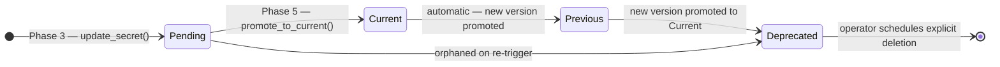

# ADR 0003: Rotation State Machine — Secret Version Lifecycle

**Status:** Accepted
**Date:** 2026-04-22

## Context

Secret rotation is a distributed write that modifies state in two separate systems: OCI Vault (the authoritative secret store) and the rotation target (the system that consumes the credential). Because these two systems cannot be updated atomically, partial failure is possible at every step, and the ordering of operations determines which failures are self-recovering and which require operator intervention.

Three failure modes must be handled:

1. **Vault write fails** before any target update — neither side changed; state is fully consistent
2. **Target update fails** after a new version was written to Vault — Vault has an orphaned pending version; target still holds the old credential and is consistent with Vault CURRENT
3. **Vault promote fails** after the target was updated — target holds the new credential but Vault CURRENT still reflects the old one; the two sides are inconsistent until the next rotation trigger

The chosen ordering must minimize the blast radius of each failure mode and ensure that re-triggering rotation always converges to a consistent state.

## Decision

Operations are ordered: **(Phase 3) write new version to Vault as PENDING → (Phase 4) update target → (Phase 5) promote PENDING to CURRENT in Vault**.

The full phase sequence is:

| Phase | Operation | Log field value |
|-------|-----------|-----------------|
| 1 | Read current credential from Vault | `read` |
| 2 | Generate new credential | — |
| 3 | Write new version to Vault as PENDING | `vault_pending` |
| 4 | Push new credential to target | `target_update` |
| 5 | Promote PENDING to CURRENT in Vault | `vault_promote` |

This ordering is chosen because:

- Failure at Phase 3 leaves both sides with the old credential — no inconsistency, safe to retry immediately
- Failure at Phase 4 leaves Vault with an orphaned PENDING version but CURRENT unchanged — target is still consistent with CURRENT, and re-triggering rotation demotes the orphan and retries cleanly
- Failure at Phase 5 is the only inconsistent case, but it is recoverable: re-triggering rotation overwrites the target again and retries the promote; both sides converge on a new credential

The state diagram below shows the lifecycle of a single secret version through these phases, including the abandonment path for orphaned versions:

**Orphaned PENDING (Phase 4 failure):** When `update_credential()` raises `TargetUpdateError`, the PENDING version in Vault is abandoned. CURRENT still holds the old credential, so Vault and target are consistent with each other. Re-triggering rotation calls `update_secret()` again; OCI automatically demotes the orphaned PENDING to DEPRECATED when the new PENDING is created. The rotation proceeds from a clean state.

**Inconsistent state (Phase 5 failure):** When `promote_to_current()` raises after the target has been updated, the target holds the new credential but Vault CURRENT reflects the old one. The rotation code logs this explicitly as `INCONSISTENT STATE`. Re-triggering rotation generates another new credential, overwrites the target (which accepts the new value as a last-write-wins overwrite), writes a new PENDING version to Vault, and promotes it. Both sides converge.

## Consequences

**Easier:**
- Phase 3 and Phase 4 failures leave the system in a fully consistent state and are self-recovering on re-trigger with no operator action. Note: the credential itself is not rotated until re-trigger succeeds — if a compliance policy mandates rotation on a fixed cadence, a failed rotation may require a manual re-trigger to remain in compliance even though the system state is consistent.
- `create_pending_version()` is idempotent on retry: `update_secret()` always creates a new LATEST version; OCI demotes the previous PENDING automatically
- `promote_to_current()` is idempotent: it checks whether the target version is already CURRENT before making the API call, and returns early if so — safe to call multiple times

**Harder:**
- Phase 5 failure creates a temporary credential mismatch (target ahead of Vault CURRENT) that persists until the next rotation trigger. This is the most operationally visible failure mode and requires either a manual re-trigger or waiting for the scheduled interval
- The state machine cannot guarantee exactly-once target update execution. `update_credential()` may be called more than once across retry attempts with different credential values. The target must tolerate last-write-wins semantics. This is true of Object Storage and most credential APIs; it is not true of systems where the current credential is required to authenticate the update

## Alternatives Considered

**Update target first, then write to Vault:** If the target update succeeds but the Vault write fails, Vault and target are immediately inconsistent — the target holds a new credential that Vault CURRENT does not reflect. This is a worse failure mode than Phase 5 (which at least leaves Vault CURRENT in a known-valid state) and there is no safe re-trigger path that does not require reading Vault to know the current state.

**Write to Vault as CURRENT first, then update target:** Promoting to CURRENT before updating the target means CURRENT briefly reflects a credential the target does not yet accept. Any consumer reading CURRENT during this window would get a credential that is not yet active. The chosen ordering keeps CURRENT at the old value until the target is confirmed updated.

**Saga pattern with compensating transactions:** A full saga would model explicit rollback operations — for example, deleting the orphaned PENDING version if the target update fails. This adds significant complexity, and the rollback operations are not always safe (OCI may not permit deletion of a PENDING version). The simpler re-trigger-recovers approach is sufficient and requires no additional infrastructure.
