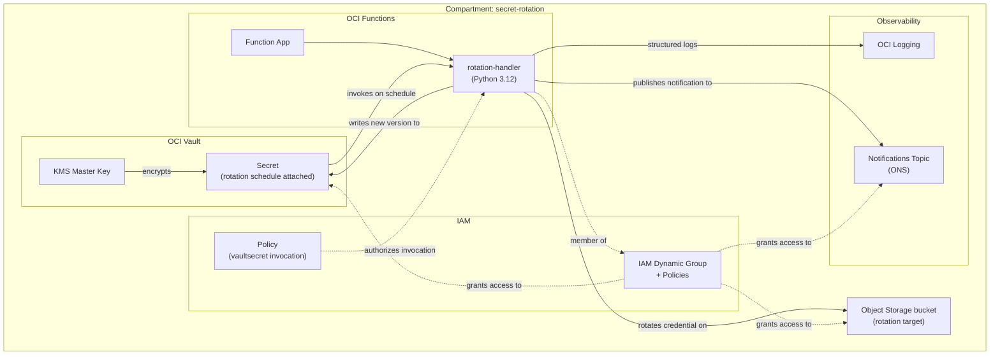
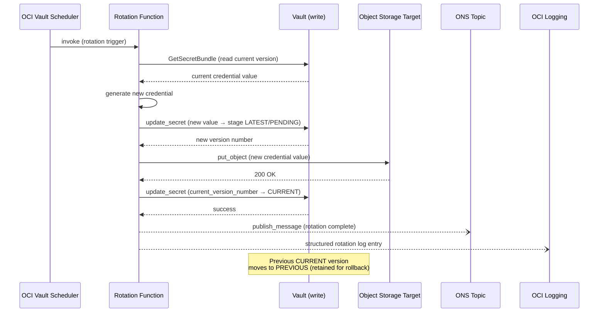

# OCI Secret Lifecycle Service — Design Document

**Status:** Accepted (M7)
**Last updated:** 2026-04-22

---

## 1. Problem Statement

Secrets — database passwords, API keys, signing tokens — have a half-life. The longer a credential lives unchanged, the larger the blast radius if it is compromised: an attacker who exfiltrates a five-year-old password has five years' worth of access to revoke and investigate. Regular rotation shrinks that window.

Rotation is operationally hard to do well. Done manually it is error-prone and skipped under pressure. Done with a custom scheduler it becomes infrastructure that must itself be secured, monitored, and maintained. The right answer is to push rotation into the platform — to use a managed service that tracks state, handles versioning, and provides an audit trail by default.

This system demonstrates the canonical OCI pattern for doing exactly that: OCI Vault's native rotation scheduling triggers a customer-owned Function that performs the actual credential change. The Function is authenticated via Resource Principal — it carries no API keys, no passwords, no credentials of its own. IAM policy grants it exactly the permissions it needs and nothing more.

The result is a rotation system that is auditable (every rotation event is captured in OCI Logging), recoverable (Vault retains previous secret versions for rollback), and operationally simple (rotation runs on a schedule without human intervention).

---

## 2. Goals and Non-Goals

### Goals

- Demonstrate the native Vault rotation scheduling + custom Function pattern end-to-end
- Authenticate the Function via Resource Principal (no long-lived credentials on any resource)
- Produce an audit trail that lets an operator reconstruct exactly what happened during any rotation
- Show least-privilege IAM scoping: compartment-scoped policies, narrow dynamic group matching
- Provide written artifacts (design doc, ADRs, threat model, runbook) that explain the *why* at each decision point

### Non-Goals

- Multi-region replication (discussed in §10; not implemented)
- Admin UI or web endpoint
- Multi-tenant isolation (single compartment is sufficient for a reference implementation)
- Exhaustive test coverage (smoke tests and key unit tests only)
- Real production target system (Object Storage demo target is sufficient to demonstrate the pattern)

---

## 3. Architecture

### Component walkthrough

**OCI Vault + KMS key.** The Vault holds the secret and its version history. A customer-managed KMS master key encrypts secret material at rest. The secret resource carries a `rotation_config` that specifies the rotation interval and the target Function OCID — this is what drives the schedule without any custom cron infrastructure.

**OCI Function (rotation handler).** A Python 3.12 function invoked by the Vault rotation scheduler. It reads the current secret, generates a new credential, updates the Object Storage target, then writes a new pending version to Vault and promotes it to current. It authenticates to OCI APIs using Resource Principal — the Function's OCID is the credential.

**Object Storage rotation target.** A private OCI Object Storage bucket that receives the new credential value on every rotation. The Function writes the credential as a named object in the bucket (`put_object`), making the result immediately observable via `oci os object get` or the Console. In a production deployment this is replaced by a call to the actual target's credential API — for example, `ALTER USER ... IDENTIFIED BY` for a database, or a vendor key-rotation endpoint for a third-party service. Only `target_client.py` changes; `rotation.py` and `vault_client.py` are target-agnostic.

**IAM dynamic group + policies.** The Function's OCID is matched by a dynamic group rule. Five IAM policy statements govern rotation: three grant the dynamic group permission to manage secrets, write to the target bucket, and publish to ONS; two grant the `vaultsecret` scheduler service permission to read and invoke the Function. All are compartment-scoped.

**OCI Logging + Notifications.** The Function emits structured JSON logs to OCI Logging on every invocation. After a successful rotation it publishes directly to an ONS topic, which delivers an email (or HTTPS) notification. OCI Events Service does not expose secret version creation events — only Customer Secret Key operations are available — so direct publish from the Function is used instead.

---

## 4. Rotation Flow

**Failure handling** is covered in detail in [ADR 0003](adr/0003-rotation-state-machine.md). Three partial-failure cases exist: (1) CreateSecretVersion fails — target untouched, state consistent, safe to retry; (2) UpdateCredential fails after PENDING created — CURRENT unchanged, target consistent with CURRENT, re-trigger creates a fresh PENDING; (3) UpdateSecretVersionStage fails after target update — target holds new credential but CURRENT still reflects old, re-trigger recovers by overwriting both.

---

## 5. Design Decisions

### Native Vault rotation scheduling over custom cron

OCI Vault's `rotation_config` on a secret resource manages the schedule, invocation, and retry. Building a custom scheduler would require additional infrastructure (a cron job, a VM or serverless trigger, state tracking) that must itself be secured and maintained. The native scheduler is managed, audited, and zero-maintenance. See [ADR 0001](adr/0001-native-rotation-scheduler.md).

### Resource Principal for Function authentication

The Function authenticates to OCI APIs using its own OCID as the credential — no API keys, no config files, no secrets stored on the Function. The IAM dynamic group rule matches the specific Function OCID, and policies grant only the permissions needed for rotation. If the Function image is compromised, the blast radius is bounded by the policy scope. See [ADR 0002](adr/0002-resource-principal-auth.md).

### Vault `DEFAULT` protection mode (software keys)

Software-protected keys are used for this reference implementation. HSM-backed (`VIRTUAL_PRIVATE`) keys provide stronger non-exportability guarantees but cost significantly more and require a dedicated HSM partition. The upgrade path is documented in §10. The rotation *pattern* is identical regardless of key protection mode.

### Single compartment

Multi-compartment separation (e.g., separating the Vault from the Function) adds policy complexity without demonstrating additional patterns. A single compartment is sufficient for a reference implementation. Cross-compartment patterns are documented as future work in §10.

### Demo rotation target (Object Storage)

Rotating against a real database or third-party API introduces external dependencies, costs, and setup complexity that distract from the pattern being demonstrated. Instead, the Function writes the new credential value to a private OCI Object Storage object after each rotation. This makes the result immediately observable (`oci os object get` or the console) without requiring an external system.

> **This is not a production pattern.** Writing credential values to Object Storage defeats the purpose of Vault as a secrets store. In a real deployment, `target_client.py` is replaced with an implementation that calls the actual target's credential API — for example, `ALTER USER ... IDENTIFIED BY` for a database, or a vendor key-rotation endpoint for an external service. Only `target_client.py` changes; `rotation.py` and `vault_client.py` are target-agnostic.

---

## 6. Rotation State Machine

Secret versions move through the following states: `PENDING` → `CURRENT` → `PREVIOUS` → `DEPRECATED`. The Function drives the `PENDING → CURRENT` transition. The Vault automatically moves the former `CURRENT` to `PREVIOUS` when a new version is promoted.

The full state diagram — including the rollback path when target update fails after a pending version has been written — is in [ADR 0003](adr/0003-rotation-state-machine.md).

---

## 7. Security Model

**Trust boundaries.** The rotation Function is the only principal that crosses the boundary between the Vault (where the secret lives) and the target (where the credential is applied). This boundary crossing is governed by IAM policy on both sides.

**Authentication model.** No component holds a long-lived credential. The Function authenticates via Resource Principal. Vault's scheduler invokes the Function using the `vaultsecret` service principal, which IAM policy authorizes to call `functions:invokeFunction`.

**Least-privilege scoping.** All policies are compartment-scoped, not tenancy-scoped. The dynamic group matches the specific Function OCID, not a broad rule like "all functions in the tenancy." If the compartment is deleted or the Function is redeployed to a new OCID, the policy stops matching — the narrowing is intentional.

**Secret version retention.** Vault retains all secret versions until explicitly pruned, up to a maximum of 30 active versions. This provides a rollback path. Soft-delete on the secret itself adds a further recovery window before permanent deletion.

**Terraform state security.** Remote state is stored in OCI Object Storage using the OCI native backend (`backend "oci"`). The backend configuration is split: non-sensitive values (bucket name, namespace, region, key path) live in `backend.hcl`, which is `.gitignore`d and never committed. The OCI native backend authenticates through `~/.oci/config` — the same API key used by the OCI Terraform provider — so no separately-managed backend credential (Customer Secret Key, access key, or service account key) is required or created.

See [docs/threat-model.md](threat-model.md) for the full STRIDE analysis.

---

## 8. Observability Model

**What is logged:**
- Every Function invocation (start, success, failure) via structured JSON to OCI Logging
- Every Vault API call is captured in OCI Audit automatically (cannot be disabled)

**What is alerted:**
- The Function publishes directly to an ONS topic after each successful rotation; subscribers receive an email or HTTPS notification
- Function invocation failures surface in OCI Logging and can be queried or alerted on
- Note: OCI Events Service does not expose secret version creation events (only Customer Secret Key operations are available), so event-driven notification is not used

**How to investigate:** See [docs/runbook.md](runbook.md) for exact CLI commands to query logs, list secret versions, and reconstruct the sequence of events after a rotation.

---

## 9. Operational Considerations

**Rotation cadence tradeoffs.** More frequent rotation reduces the window of exposure for a compromised credential but increases the operational load on the target system and the risk of a partial-rotation window (the period between the target being updated and Vault confirming the new version). For most use cases, 30–90 day intervals balance risk reduction against operational noise.

**Blast radius of failure.** If the Function fails after updating the target but before promoting the new Vault version to CURRENT, the target holds a new credential that Vault does not know about. The recovery path — re-trigger rotation — is documented in the runbook. The state machine is designed to detect and recover from this case.

**Rollback path.** Previous secret versions are retained in Vault. Rolling back means promoting the previous version to `CURRENT` and re-applying the old credential to the target. The runbook documents the exact steps.

---

## 10. Future Work

- **Multi-region replication.** Vault secrets can be replicated to a secondary region using OCI Vault cross-region replication. The rotation Function would need to be deployed in both regions, or a single-region Function would need to update both Vault instances. Not implemented here.
- **Cross-tenancy access.** Secrets shared across tenancies require cross-tenancy IAM policies. The pattern is documented in the OCI IAM docs but is out of scope for this reference.
- **HSM-backed keys.** Upgrading from `DEFAULT` to `VIRTUAL_PRIVATE` protection mode requires destroying and recreating the KMS key (and therefore the secret). Plan for this before using this pattern with highly sensitive material.
- **Real target integrations.** Replacing the Object Storage target with a real database (e.g., using OCI Database's password rotation API) or a third-party secret (e.g., a GitHub PAT) follows the same pattern — only `target_client.py` changes.
- **CI/CD for Function updates.** A GitHub Actions workflow that builds, pushes, and redeploys the Function on merge to `main` is a natural extension.
